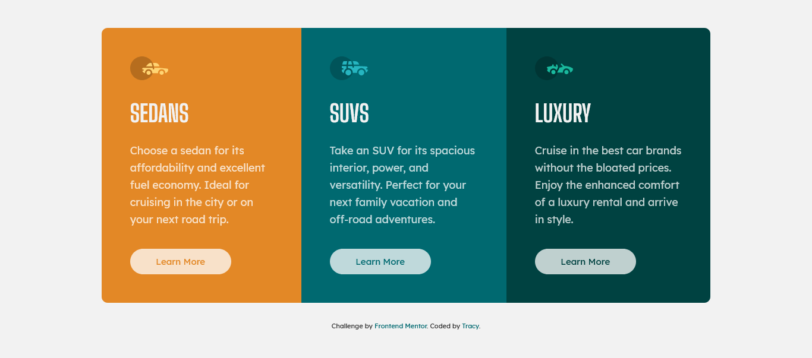

# 3-column-preview-card-component

## Table of contents

- [Overview](#overview)
  - [Screenshot](#screenshot)
  - [Links](#links)
- [My process](#my-process)
  - [Built with](#built-with)
- [Author](#author)

## Overview

### Screenshot

### Links

- Solution URL: [My solution](https://www.frontendmentor.io/solutions/mobile-first-using-css-flexbox-KzhegsIOc)
- Live Site URL: [Hosted on Netlify](https://fm-3column-preview-card-component.netlify.app/)

## My process

### Built with

- Semantic HTML5 markup
- CSS
- Flexbox
- Mobile-first workflow

## Author

- Frontend Mentor - [tracycod3r](https://www.frontendmentor.io/profile/tracycod3r)
- Twitter - [tracycod3r](https://www.twitter.com/tracycod3r)
